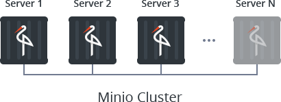
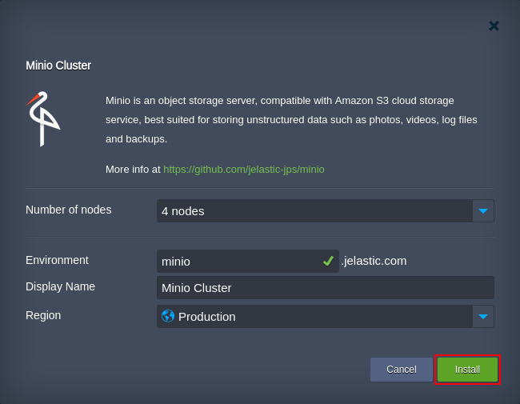

# Minio Cluster

The **Minio Cluster** solution by Jelastic automates creation of a scalable and cost-efficient object storage, which is fully compatible with the Amazon S3 (_Simple Storage Service_). The package utilizes [Minio](https://www.minio.io/) microstorage architecture to interconnect a number of separate Docker containers to create a reliable cluster.

Refer to the appropriate Minio Cluster article to get a detailed overview of this solution.

## Minio Cluster Installation

Log into your Jelastic account and [import](https://docs.jelastic.com/environment-import) link to the _**manifest.jps**_ file from above.

> **Note:** Alternatively, you can find this solution within [Jelastic Marketplace](https://docs.jelastic.com/marketplace) or use the following button to automatically register on one of the [public Platforms](https://jelastic.cloud/) and immediately initiate Minio Cluster installation:
> 
>  ](https://jelastic.com/install-application/?manifest=https://raw.githubusercontent.com/jelastic-jps/minio/master/manifest.jps&min-version=4.6)

Within the appeared form, you need to fetch the next data:
* **Number of nodes** - specify the required cluster size by choosing among the predefined options to create 1 (for development), 4, 8 or 16 Minio nodes - each of them will be handled in a separate container, which are distributed across available hardware servers to gain [high availability](https://docs.jelastic.com/isolated-containers?utm_source=minio-cluster#b)
* **Environment** - type in the preferred name for your Minio storage cluster (which, together with your platform domain, will constitute an internal environment name)
* **Display Name** - optionally, add an [alias name](https://docs.jelastic.com/environment-aliases) to be displayed for the environment in the dashboard
* **Region** - select a [hardware set](https://docs.jelastic.com/environment-regions) for your environment to be hosted (this option is active only if several regions are available)

Click **Install** and in a few minutes your automatically configured storage will be created.

## Working with Minio Cluster

Immediately after the solution installation, you can start working with your storage cluster:

* _**user-friendly web interface**_ - to manage your Minio storage directly in browser; the admin panel access URL and credentials are provided via the appropriate email notification

* _**minio client**_ - to work over the dedicated [command line interface](https://www.minio.io/downloads.html#download-client); refer to the [official documentation](https://docs.minio.io/docs/minio-client-complete-guide) for more information on the tool
